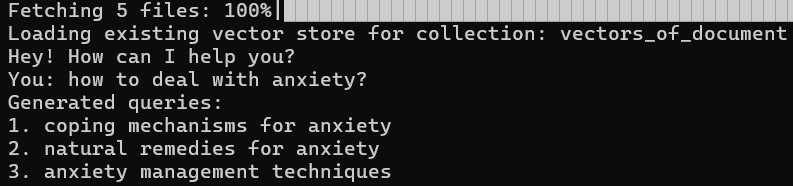

# Anxiety-Related RAG Chatbot using LlamaIndex

Welcome to the **Anxiety-Related RAG Chatbot** repository! This project uses [LlamaIndex](https://github.com/run-llama/llamaindex) to build a Retrieval-Augmented Generation (RAG) chatbot. The chatbot is designed to assist users by answering questions related to anxiety, based on information extracted from an anxiety-related PDF.

## Table of Contents

- [Introduction](#introduction)
- [Features](#features)
- [Installation](#installation)
- [Usage](#usage)
- [Contributing](#contributing)
- [License](#license)

## Introduction

This project aims to provide an intelligent chatbot capable of answering queries about anxiety, leveraging the power of LlamaIndex for document-based retrieval and a powerful language model for generating responses. The data source for the chatbot is a PDF document containing detailed information on anxiety, including causes, symptoms, and management strategies.

## Features

- **RAG (Retrieval-Augmented Generation) System**: Combines the strength of retrieval-based methods with generative models to provide accurate and contextually relevant answers.
- **Data Source**: Utilizes an anxiety-related PDF as the primary knowledge base.
- **Memory Integration**: The chatbot maintains conversation context to deliver coherent and informed responses over multiple interactions.
- **RAG Fusion Integration**: The chatbot is configured to use RAG Fusion to improve the quality of document retrieval. For each user query, RAG Fusion generates two additional queries to ensure that the retrieved documents are comprehensive and relevant.

### RAG Fusion

**RAG Fusion** (Retrieval-Augmented Generation Fusion) is a technique used to enhance the accuracy of the chatbot's responses. For each user question, RAG Fusion generates additional related queries to retrieve a broader set of documents. The information from these documents is then combined to produce a more comprehensive and informed answer.
<figure>
  
  <figcaption>Fig.1 - Generated queries to retrieve broder set of documents</figcaption>
</figure>

#### Example:

**User Question**: "How is anxiety tackled?"

1. **Initial Query**:
   - "How is anxiety tackled?"

2. **Generated Extra Queries**:
   - "What are the common treatments for anxiety?"
   - "How can anxiety be managed effectively?"

3. **Document Retrieval**:
   - The system retrieves documents related to all three queries.

4. **Fused Response**:
   - The chatbot combines information from the retrieved documents and responds:
     > "Anxiety is tackled through a combination of therapies, such as cognitive-behavioral therapy (CBT), medication, lifestyle changes, and self-care practices. Common treatments include regular exercise, mindfulness practices, and sometimes the use of medications like SSRIs to manage symptoms effectively."

This approach ensures that the chatbot's responses are well-rounded, covering multiple aspects of the user's question.

## Installation

### Prerequisites

- Python 3.12+
- [Pip](https://pip.pypa.io/en/stable/installation/)
- [Docker](https://www.docker.com/) (optional, for containerized deployment)

### Clone the Repository

```
git clone https://github.com/yourusername/anxiety-rag-chatbot.git
cd anxiety-rag-chatbot
```

### Running Qdrant with Docker

To start a Qdrant instance using Docker, run the following command:

```
docker run -p 6333:6333 qdrant/qdrant
```

### Install Dependencies

Install the necessary Python packages:

```
pip install -r requirements.txt
```

### Setting Up Environment Variables

To configure the environment variables for this project, follow these steps:

1. **Copy the Example File**:
   - Start by copying the `.env_example` file to create a new `.env` file. This `.env` file will store all the necessary environment variables for your local development environment.

   ```
   cp .env_example .env
```
2. **Populate the `.env` File

- After copying the `.env_example` file to `.env`, open the `.env` file in your text editor and replace the placeholder values with your actual environment-specific values.


# Usage

## Running the chatbot locally
To start the chatbot locally, run the following command:
```
python main.py
```
